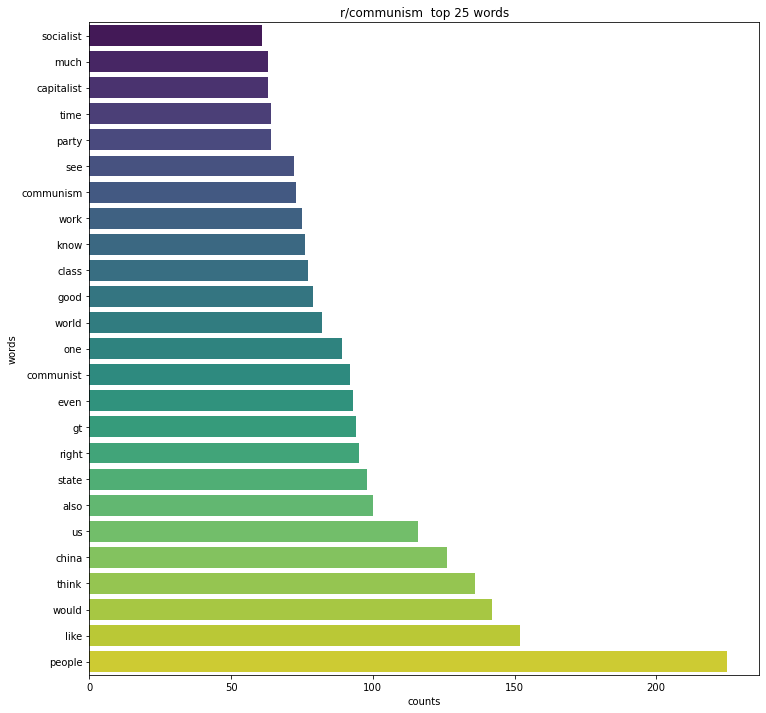

#  Project 3: Web APIs & NLP
# Classification models on subreddits [r/Capitalism and r/communism]

### 1. Problem statement
This projects seeks to demonstrate a classification model that is capable of classifying the subreddits of **r/Capitalism** and **r/communism** better than the baseline model given by the majority class in the dataset collected. In addition, the goal for this data analysis is to provide more information of the sentiment that users display on each of the subreddits and how sentiment and influence in some degree to the accuracy of the classifier. 

The classification model uses ensemble methods in order to reduce the risk of overfitting and have a good perform in unseen data by combining predictions from several base models.  

**Accuracy** is used as the metric for evaluation for all the models, and depending the model’s performance on this metric the final model is determined. 

### 2. Data Collection
Data collection was performed with the help of the [Pushshift's](https://github.com/pushshift/api) API which allows us to search all publicly available comments and submissions on Reddit. For this particular case the text to be classified  only considers the **comments** section of each post, this decision was made with the idea of having more available text that could allow a better prediction of the models implemented. In addition, the interactions between users in the comments section is a critical component on how to determine the general sentiment of the users that use that particular subreddit. 

A size of 100 most recent comments was extracted for each of the last 11 months starting form (10/19/2020) for both the r/Capitalism and r/communism subreddits. This data was then used to created a single balanced dataset containing **2200** observations. 

In this project all the datasets used are cointained in the `data` folder which contains the following csv:
- `combined.csv` : contains all the raw dataset extracted with the help of the pushshift  API. 
- `data_modeling_V2.csv`: contains dataset created from notebook `data_cleaning_EDA-P` and used for the model creation on `code/models-V2.ipynb`

### 3. Data Cleaning + EDA
Goals after performing data cleaning on 2200 comments extracted:
1. Remove presence of URLs
	- **Comment:** The presence of URLs in the body of the text was low, the highest count obtained for a URL was of 10. Due to this I decided to remove all instances inside the body of each comment.
2. Remove presence of Russian and Chinse words
	- **Comment:** There was a high presence of non english words 
	- **Limitations:** In the model section we might be able to see the implications of removing these words in the performance of our models.
3. Remove english stop words
	- **Comment:** stop words were taken from the `nltk.corpus` library. 
4. Remove numerical values
5. Take care of all removed comments by users
6. Binarize class
	- **Comment:**  Column `subreddit` was binarized, and `1` was mapped to `Capitalism` and `0` was mapped to `communism`

##### EDA on Vectorized text
By using `CountVectorizer` method from `klearn.feature_extraction` the preprocessed body of text was converted into a collection of text documents to matrix of taken counts.

- Top 25 words in combined dataset of r/Capitalism and r/communism

- Top 25 words on dataset of r/Capitalism

- Top 25 words on dataset of r/communism

- Words clouds for both r/Capitalism and r/communism

**Comment:**: As seen in the Top words used in both reddits and in the word clouds we can see how there are no high counts of distinct words. 

##### EDA on VADER
By using `SentimentIntensityAnalyzer()` from `nltk.sentiment.vader` sentiment anlysis was performed to all the comments.[[Source]](https://github.com/cjhutto/vaderSentiment)

`r/Capitalism` compared with `r/communism` has a distribution that shows that it tends to contain more positive text. The following table shows the thresholds for classifying text according to their compound score. [[source]](https://github.com/cjhutto/vaderSentiment/blob/master/README.rst)

-  **positive sentiment**: ``compound`` score >=  0.05
-  **neutral  sentiment**: (``compound`` score > -0.05) and (``compound`` score < 0.05)
-  **negative sentiment**: ``compound`` score <= -0.05

### 4. Models
The following table shows the summary of all the models created: 

| Model                   | Score on training set  | Score on testing set  | Vectorized text  | VADER sentiment analysis |
|-------------------------|------------------------|-----------------------|------------------|--------------------------|
| RFC+GS                  | ~ 0.9849               | ~ 0.7116              | Yes              | No                       |
| Logistic Reg + GS       | ~ 0.9071               | ~ 0.7382              | Yes              | No                       |
| RFC + GS                | ~ 0.9979               | ~ 0.7668              | Yes              | Yes                      |
| Logistic Reg + GS       | ~ 0.9098               | ~ 0.7525              | Yes              | Yes                      |
| Ensemble [LogReg + RFC] | ~ 0.9938               | ~ 0.7689              | Yes              | Yes                      |

### 5. Conclusion + Recommendations
The use of sentiment analysis metrics as part of the features used in the model to classify the holdout test set of subreddits of c/Capitalism and c/communism was essential for the creation of a  model that could generalize better on unseen data. As seen in the word clouds for both subreddits there is high similarity of words used in both comment sections, and because of this it makes it harder for the model without VADER to obtain an acceptable accuracy score in the test set. 

It is recommended to use tools such as VADER to have a better classification model. Furthemore, because of the presence of other languages it might be useful to incorporate corpus from Russian and Chinese languages. 
